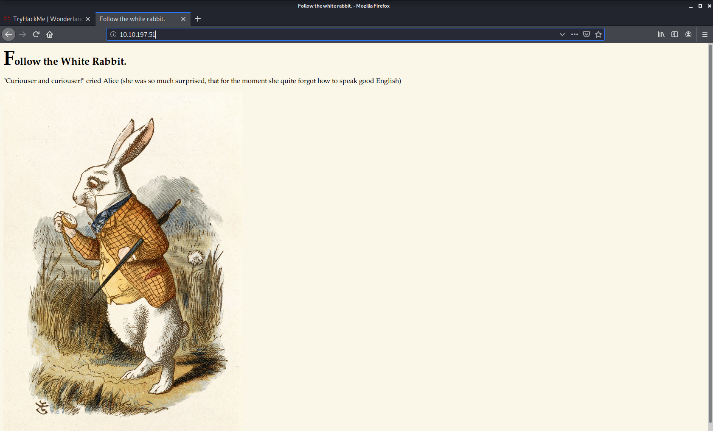

# Wonderland_tryhackme
wonderland tryhackme walkthrough still in progress

nmap ,gobuster results:

nmap scan results:
PORT   STATE SERVICE VERSION
22/tcp open  ssh     OpenSSH 7.6p1 Ubuntu 4ubuntu0.3 (Ubuntu Linux; protocol 2.0)
| ssh-hostkey: 
|   2048 8e:ee:fb:96:ce:ad:70:dd:05:a9:3b:0d:b0:71:b8:63 (RSA)
|   256 7a:92:79:44:16:4f:20:43:50:a9:a8:47:e2:c2:be:84 (ECDSA)
|_  256 00:0b:80:44:e6:3d:4b:69:47:92:2c:55:14:7e:2a:c9 (ED25519)
80/tcp open  http    Golang net/http server (Go-IPFS json-rpc or InfluxDB API)
| http-methods: 
|_  Supported Methods: GET HEAD POST OPTIONS
|_http-title: Follow the white rabbit.
No exact OS matches for host (If you know what OS is running on it, see https://nmap.org/submit/ ).
TCP/IP fingerprint:
OS:SCAN(V=7.80%E=4%D=11/1%OT=22%CT=1%CU=35429%PV=Y%DS=2%DC=T%G=Y%TM=5F9E442
OS:7%P=x86_64-pc-linux-gnu)SEQ(SP=105%GCD=1%ISR=10D%TI=Z%CI=Z%TS=C)SEQ(SP=1
OS:06%GCD=1%ISR=10D%TI=Z%CI=Z%II=I%TS=A)OPS(O1=M508ST11NW6%O2=M508ST11NW6%O
OS:3=M508NNT11NW6%O4=M508ST11NW6%O5=M508ST11NW6%O6=M508ST11)WIN(W1=F4B3%W2=
OS:F4B3%W3=F4B3%W4=F4B3%W5=F4B3%W6=F4B3)ECN(R=Y%DF=Y%T=40%W=F507%O=M508NNSN
OS:W6%CC=Y%Q=)T1(R=Y%DF=Y%T=40%S=O%A=S+%F=AS%RD=0%Q=)T2(R=N)T3(R=N)T4(R=Y%D
OS:F=Y%T=40%W=0%S=A%A=Z%F=R%O=%RD=0%Q=)T5(R=Y%DF=Y%T=40%W=0%S=Z%A=S+%F=AR%O
OS:=%RD=0%Q=)T6(R=Y%DF=Y%T=40%W=0%S=A%A=Z%F=R%O=%RD=0%Q=)T7(R=Y%DF=Y%T=40%W
OS:=0%S=Z%A=S+%F=AR%O=%RD=0%Q=)U1(R=Y%DF=N%T=40%IPL=164%UN=0%RIPL=G%RID=G%R
OS:IPCK=G%RUCK=G%RUD=G)IE(R=Y%DFI=N%T=40%CD=S)

gobuster results:
===============================================================
/img (Status: 301)
/r (Status: 301)
/poem (Status: 301)
/http%3a%2f%2fwww (Status: 301)

http://<ip>:80
  

"Curiouser and curiouser!" cried Alice 
(she was so much surprised, that for the moment she 
quite forgot how to speak good English)

well what i find in 
/r directry is 

"Would you tell me, please, which way I ought to go from here?"

using stegihide to see hidden data 

steghide --extract -sf .jpg/png

alice:HowDothTheLittleCrocodileImproveHisShiningTail

